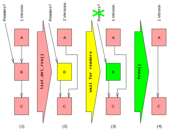

## `RCU`是什么

`Read-Copy Update`是一种同步机制，用于提高读者多、写者少的情况下的效率，其基本想法是：

将更新划分为`removal`和`reclamation`，首先删除或更改引用，这一步可以与读者并发（基于现代处理器的特性），读者要么看到旧版本数据，要么看到新版本数据；然后等待所有读者读取结束后对数据进行更改。

将更新分为3个步骤：

1. 修改指向待更新项的指针，使得接下来开始读取该数据结构的读者不会读取到待更新项；
2. 等待之前正在读取待更新项的读者完成读取；
3. 此时不会再有读者正在读取该项，可以安全地更新。

`RCU`的重要特点是：即使数据结构正在被更新，读者仍然可以访问。以从链表$L$中删除元素$B$为例（这里借用维基百科上的图，来源[Read-copy-update - Wikipedia](https://en.wikipedia.org/wiki/Read-copy-update)）：



操作过程的4个状态及其转换过程如下：

| 状态                           | 性质                                                         | 操作                                       |
| :----------------------------- | :----------------------------------------------------------- | :----------------------------------------- |
| $L$未被修改                    | 有任意多的读者，记正在读取$i$为$R_i$($i = A, B, C$)          | 使$A$的尾指针指向$C$                       |
| $A$的下一个元素为$C$，其余不变 | 对于$R_A$中的读者，“下一个元素”将是$C$；<br />对于$R_B$中的读者，“下一个元素“也将是$C$ | 等待$R_B$成为空集，即$B$的所有读者完成操作 |
| $A$的下一个元素为$C$，其余不变 | $B$已没有读者，可以放心地更改                                | 释放$B$占用的内存                          |
| $B$被删除                      | 操作完成                                                     |                                            |

上面这个例子演示了怎样在不阻塞读者的同时对数据结构进行更新。

`RCU`的核心api有：

* `rcu_read_lock()`
* `rcu_read_unlock()`
* `synchronize_rcu() / call_rcu()`
* `rcu_assign_pointer()`
* `rcu_dereference()`

## 分析

给`rcu_init()`打上断点，执行到此处，该函数的源码如下：

```c
void __init rcu_init(void)
{
	int cpu;

	rcu_early_boot_tests();

	rcu_bootup_announce();
	rcu_init_geometry();
	rcu_init_one(&rcu_bh_state);
	rcu_init_one(&rcu_sched_state);
	if (dump_tree)
		rcu_dump_rcu_node_tree(&rcu_sched_state);
	__rcu_init_preempt();
	open_softirq(RCU_SOFTIRQ, rcu_process_callbacks);

	/*
	 * We don't need protection against CPU-hotplug here because
	 * this is called early in boot, before either interrupts
	 * or the scheduler are operational.
	 */
	pm_notifier(rcu_pm_notify, 0);
	for_each_online_cpu(cpu) {
		rcutree_prepare_cpu(cpu);
		rcu_cpu_starting(cpu);
	}
}
```

` rcu_early_boot_tests()`，对于我编译的内核，该函数的函数体为空。

`rcu_boot_announce()`这个函数首先以`"Hierarchical RCU implementation.\n"`为参数调用`pr_info()`（对`printk()`的一个包装），然后调用`rcu_bootup_announce_oddness()`。这个函数根据一些变量和宏输出一些字符串，描述和当前rcu的配置相关的信息，这也解释了函数名中的announce。

关于`rcu_init_geometry()`，大致浏览了一下这段代码发现有`leaf`之类的东西出现，觉得很奇怪，查了查发现，原来原始的rcu由于全局锁的使用，随着机器核数的增多，性能会明显的下降。考虑到当今并行化的趋势，linux内核中的实现采用了一种叫Hierarchical RCU的实现，可以明显缓解多核使用全局锁造成的性能下降。Hierarchical RCU的基本思想是使用树状的结构来减少对全局锁同时访问的次数。

`rcu_init_one()`这个函数的功能是初始化一个使用rcu来维护的数据结构，该函数被调用了两次，分别对`rcu_bh_state`和`rcu_sched_state`进行初始化。

`__rcu_init_preempt()`这个函数是空的。

`open_softirq()`将`RCU_SOFTIRQ`类型的软中断以及相应的中断处理函数`rcu_process_callbacks()`加入到软中断序列中。

接下来是：

```c
for_each_online_cpu(cpu) {
    rcutree_prepare_cpu(cpu);
    rcu_cpu_starting(cpu);
}
```

可以看出这段代码是对每个在线的CPU准备rcu树，通过查看`rcu_cpu_starting()`的注释可知`rcu_cpu_starting(cpu)`是把当前的CPU标记为在线状态，使得之后RCU的grace period会等待该CPU。

到此，RCU的初始化工作就完成了。

## 参考资料

[whatisRCU](https://www.kernel.org/doc/Documentation/RCU/whatisRCU.txt)

[Hierarchical RCU](https://lwn.net/Articles/305782/)

[Linux 2.6内核中新的锁机制--RCU](https://www.ibm.com/developerworks/cn/linux/l-rcu/)
