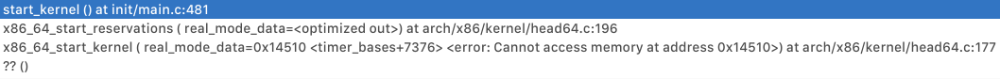

## 实验要求

使用调试跟踪工具，追踪自己的操作系统（建议Linux）的启动过程，并找出其中至少两个关键事件。

## 主要调试方法

编译一份带调试信息的内核，在qemu中启动，并使用gdb进行调试分析。

## 调试步骤

1. 使用`apt source linux-image-4.9.0-6-amd64`从debian的官方仓库得到linux 4.9.86的源代码；
2. 编译内核：
   1. `make menuconfig`时启用以下选项：
      * Compile the kernel with debug info.
   2. 使用`make`命令编译。

2. 拷贝本机的初始化内存盘（initrd.img，方便起见选择本机）；

3. 启动qemu并指定gdb端口：

   方便起见将命令写入了`boot.sh`这个脚本中；需要给内核传递`nokaslr`参数来关闭地址空间随机化，否则断点无效。

4. 进入源码目录，使用`kdbg -r localhost:1234 vmlinux`启动调试器：

   kdbg是一个图形化的前端，后端仍然使用gdb；

   由于我的机器上的gdb（7.9.1）不能察觉long mode的切换，需要手动修改gdb源码并重新编译，对源码的修改参考自[这里](https://wiki.osdev.org/QEMU_and_GDB_in_long_mode)。

## 分析内核启动的大致流程

启动虚拟机后启动gdb，先在`start_kernel()`处打上断点，然后执行到此处，查看堆栈信息，如下：

可以看到在`start_kernel()`之前，主要是体系结构相关的一些初始化工作，暂不分析，查看`start_kernel()`的代码，主要有以下事件：

* cgroup的早期初始化
* 初始化boot CPU
* 设置log缓冲区
* 虚拟文件系统（VFS）cache的早期初始化
* 初始化trap表
* 初始化内存管理
* 初始化调度器
* **初始化RCU（之后进一步分析）**
* 初始化中断处理机制
* 初始化定时器
* 初始化软中断
* 初始化cgroup
* **调用`rest_init()`（之后进一步分析）**

我比较感兴趣的是最后被调用的`rest_init()`以及RCU机制，于是决定分析一下这两个函数，见另外两个文件[./rcu_init.md](./rcu_init.md)和[./rest_init.md](./rest_init.md)。

## 总结

通过分析linux内核启动过程，我了解到了内核启动中主要的一些（体系结构无关的）事件，以及RCU机制是什么、内核在启动的最后阶段做了哪些事情。